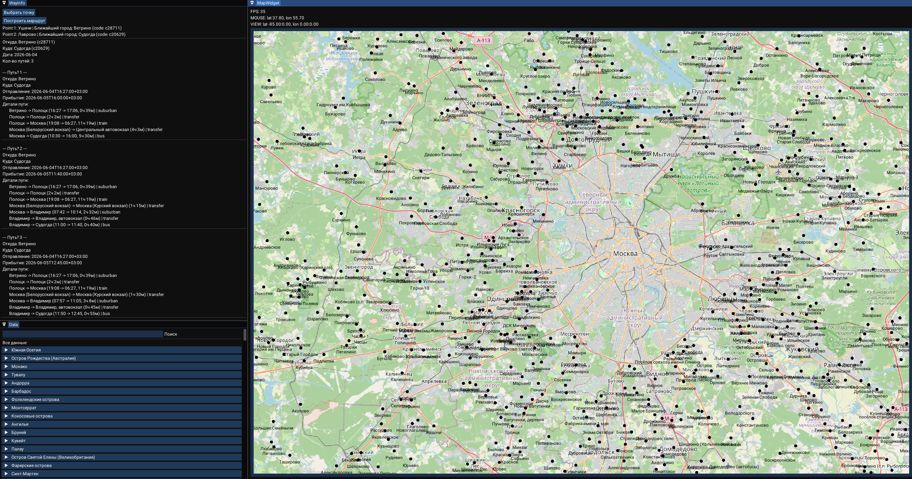
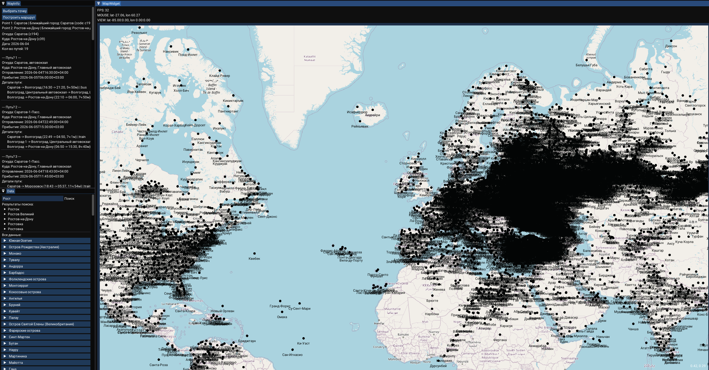

# ImGuiYandexMap
An interactive map application built with ImGui and ImOsmWidget.

This fork enhances the original demo by integrating Yandex Schedule API, allowing users to visualize transport stations and build routes directly on the map.

## Screenshots




## Ubuntu dependencies

For ImGui with GLFW backend the following packages must be installed
```
libx11-dev libxrandr-dev libxinerama-dev libxcursor-dev libxi-dev freeglut3-dev
```
For ImOsmWidget libcurl needed
```
libcurl4-gnutls-dev
```

## Fork Improvements

Compared to the original ImOsmDemo:

- Added Yandex API integration
- Added transport station rendering
- Added route calculation

## Credits

- Original ImOsmDemo project
- ImOsmWidget
- OpenStreetMap
- Yandex Schedule API